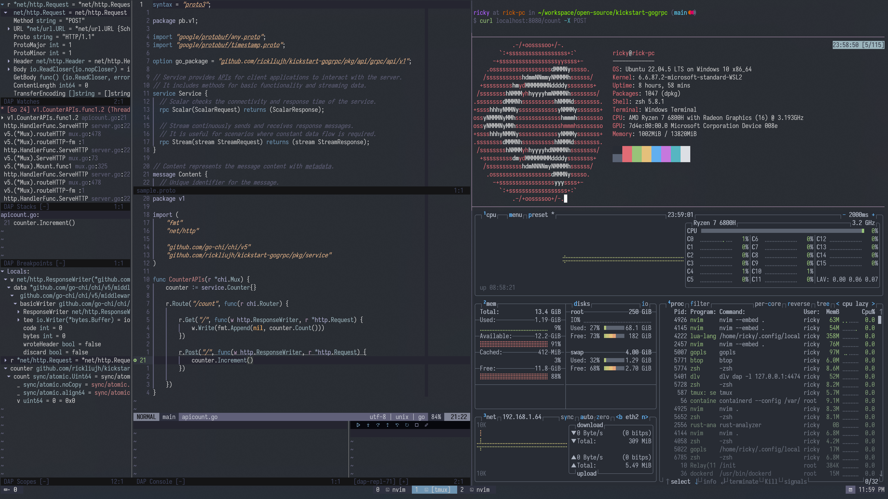

# dotfiles
Linux and desktop configuration and setup scripts.

## Features



1. Integrated development environment runs on everywhere
    - neovim
    - tmux
    - LSP for any languages
    - personal themes
2. Tools that are necessary for Linux as Developer
    - zsh and autocompletion for docker, kubectl, aws, etc.
    - btop, ripgrep, bat, fzf
    - lazygit
    - docker, sysbox
3. Ergonomic keymaps, shortcuts, and config of personal take
    - .gitconfig
    - .tmux.conf
    - neovim, .vimrc
    - helper functions
    - .zshrc, .bashrc
4. Remote development on any cloud environment and docker container


## Installation

### Download
`git clone git@github.com:rickliujh/dotfiles.git`

### Usage
1. `bash setup.sh -m` show menu.
2. `bash setup.sh -a` setup all things.
3. `bash setup.sh -i` install all packages and languages.
4. `bash setup.sh -l` setup symlinks only.
5. `bash setup.sh -b` backup current dotfiles (only those files that has same name in config dir in this repo).
6. `bash setup.sh {{func_name}}` you can actually call any function that declared in shell file in root folder by putting its name after setup.sh separated by space as long as you know what you're doing.

## Next...
1. understanding fzf and its config 
2. ~~understanding bashrc~~
3. understanding zshrc with oh-my-zsh 
4. ~~setting up tmux~~
5. understanding eza and its config and how to integrating with zsh(require 3)
6. ssh port forward script for remote development

## Inspired by
- [2KAbhishek/dots2k: Passionately crafted for CLI lovers (github.com)](https://github.com/2KAbhishek/dots2k)
- [felipecrs/dotfiles: Bootstrap your Ubuntu in a single command! (github.com)](https://github.com/felipecrs/dotfiles)

## Remote Development
Combining dotfiles and Dockerfiles in the `dockerfiles` directory enable you pioneering your project with excellent remote development environment

### Usage
```
# First build your image with your identity
docker build -f=nodedev.Dockerfile -t=nvimnode:v0.1 --build-arg=EMAIL={{YOUR_EMAIL}} --build-arg=NAME={{YOUR_NAME}} --build-arg=PASSWD={{YOUR_PASSWD}} .

# Second start a container by mount your project into docker or you can use git to download later on
docker run -v ~/workspace/{{YOUR-PROJECT}}:/root/workspace/{{YOUR-PROJECT}} -p 8654:22 --name {{IMAGE_NAME}} -d -it nvimnode:v0.1

# use ssh to start a tmux session in the very first time
ssh user@<hostname> -p 8654 -t "tmux new -s {{TMUX_SESSION}}" 

# use ssh to attach a tmux session next time
ssh user@<hostname> -p 8654 -t "tmux a -t {{TMUX_SESSION}}"

# enjoy your journey
```
> [!Note] 
> Don't forget to setup your ssh key in the very first time. The script will not setup it for you for security reason.

## MISC

### WSL2 native docker setup without docker desktop

if WSL2 is not booted by systemd, you will need to put below script in ~/.local.sh for starting dockerd automatically.

```
# Check if dockerd is already running
if ! pgrep -f "dockerd" > /dev/null; then
    sudo bash -c "/usr/bin/dockerd > /var/log/dockerd.log 2>&1 &"
    echo "Docker daemon started (log: /var/log/dockerd.log)"
fi
```
